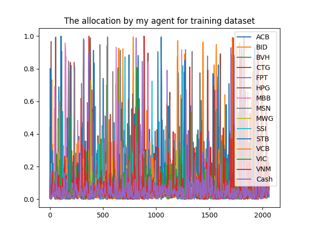
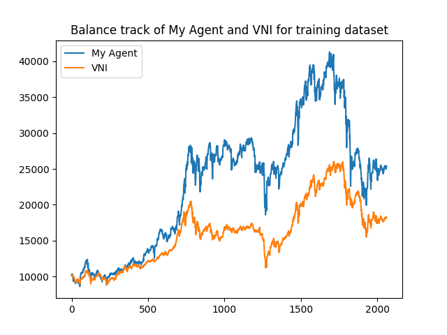
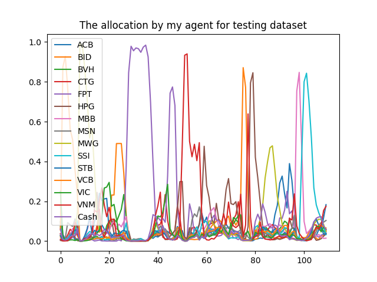
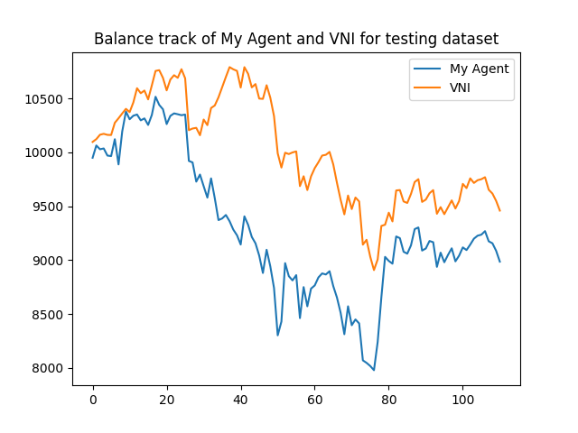

# A DRL Framework for Portfolio Management: Application for Vietnamese stocks

This project draws inspiration from the deep reinforcement learning framework for portfolio management proposed by [Jiang et al. in 2017](https://arxiv.org/abs/1706.10059). I conduct further investigation into the original architecture introduced by Jiang et al, tailoring it for implementation in the Vietnamese stock market. The portfolio encompasses 14 distinct stocks, detailed in below table. The objective is to formulate a reward function that maximizes the risk-adjusted return of the portfolio relative to the benchmark (VNI - VN Index)

| Num | Ticker | Description
| --- | --- | --- |
| 1 | ACB | Asia Commercial Joint Stock Bank
| 2 | BID | Joint Stock Commercial Bank for Investment and Development of Vietnam (BIDV)
| 3 | BVH | BaoViet Holding
| 4 | CTG | Vietnam Joint Stock Commercial Bank for Industry and Trade (VietinBank)
| 5 | FPT | FPT Corporation
| 6 | HPG | Hoa Phat Group
| 7 | MBB | Military Commercial Joint Stock Bank
| 8 | MSN | Masan Group
| 9 | MWG | Mobile World Investment Corporation (The Gioi Di Dong)
| 10 | SSI | SSI Securities Corporation
| 11 | STB | Sai Gon Thuong Tin Joint Stock Commercial Bank (Sacombank)
| 12 | VCB | Joint Stock Commercial Bank for Foreign Trade of Vietnam (Vietcombank)
| 13 | VIC | Vingroup Joint Stock Company
| 14 | VNM | Vinamilk


## Usage Guideline

To begin, ensure the installation of the necessary packages outlined in the <i>requirements.txt</i> file. The focal point of my repository revolves around the training and testing processes. The training process is executed through the <i>train.py</i> file. If required, you have the flexibility to modify hyperparameters for the agent and training process; however, it is imperative to have a clear understanding of each parameter. No validation function is implemented to assess the suitability of hyperparameters, so errors may arise if the provided parameters are inappropriate. Subsequent to the training phase, the trained agent is saved as a pickle file. The <i>test.py</i> file is designed to load this pickle file for testing purposes, accompanied by visualizations of the performance.

### Quick Start
Start with following commands:
```
$ git clone https://github.com/VoHieu2402/PGPortfolio_VNStocks
$ cd PGPortfolio_VNStocks
$ python train.py
$ python test.py
```

### File Structure

- <b>data/torch_tensor_vn_stocks</b>: The training dataset spans from January 1, 2015, to June 1, 2023, while the testing dataset covers the period from June 1, 2023, to December 19, 2023. Historical Close-High-Low (CHL) data serves as the representation of the market state in our approach. The chosen lag is 30 previous time steps (equivalent to one month)
    - <b>state_tensor_pf_vnstocks_train.pt</b>: A PyTorch tensor that holds information about the state of 14 different stocks for training. It undergoes processing as described in the original paper. It has shape: <i>(batch_size, num_features, num_stocks, num_lags)</i>
    - <b>state_tensor_pf_vnstocks_test.pt</b>: A PyTorch tensor that holds information about the state of 14 different stocks for testing. It undergoes processing as described in the original paper. It has shape: <i>(batch_size, num_features, num_stocks, num_lags)</i>
    - <b>state_tensor_pf_VNI_train.pt</b>: A PyTorch tensor that holds information about the state of the benchmark (VN Index) for training. It undergoes processing as described in the original paper. It has shape: <i>(batch_size, num_features, 1, num_lags)</i>
    - <b>state_tensor_pf_VNI_test.pt</b>: A PyTorch tensor that holds information about the state of the benchmark (VN Index) for testing. It undergoes processing as described in the original paper. It has shape: <i>(batch_size, num_features, 1, num_lags)</i>
- <b>deep_learning_model</b>:
    - <b>actor_network.py</b>: The deep neural network that determines the allocation directly based on the state tensor. The architecture of the network is described in the original paper.
- <b>reinforcement_learning_algorithms</b>:
    - <b>replay_buffer.py</b>: The database used to stores experiences in the form of tuples <i>(state_portfolio, action, reward, next_state_portfolio, state_benchmark, next_state_benchmark, prev_action, prev_pf, prev_bm, pre_each_asset)</i>, representing the agent's interactions with the environment at different time steps.
    - <b>policy.py</b>: The policy that select actions using actor network.
    - <b>agent.py</b>: An agent that interacts with an environment with the goal of learning optimal actions to maximize cumulative rewards over time. It is responsible for making decisions, taking actions, and learning from the consequences of those actions.
- <b>train.py</b> During the training process, the agent undergoes many episodes, each involving the management of a portfolio comprising 14 distinct stocks and cash to maximize the final risk-adjusted return. In each episode, the agent has traded over the whole period of the training dataset.
- <b>test.py</b> The tested agent evaluates the portfolio management strategy over a period comprising 112 time steps. Additionally, visualizations are generated in this file.


## New contributions to the original architecture

### Reward function

While the original framework calculates the reward as the explicit average of periodic logarithmic returns, my project defines the reward function that combines the original reward with a weighted factor representing the difference between the agent's risk-adjusted return and that of the benchmark. This addition of a risk element aims to enhance the stability of the portfolio management strategy, preventing excessive allocation to specific assets.

Moreover, employing risk-adjusted returns allows us to track the value of the portfolio over time. Integrating the portfolio value into the model enhances the agent's awareness of its position, facilitating more informed decision-making.

### Learning rate schedules

Instead of utilizing a constant learning rate, I utilize learning rate schedules to reduce the learning rate after each episode. This method is believed to improve the optimization process, particularly in the context of risk-adjusted returns, where daily returns are often very small.

## Performance and some discussion

### Performance
Constrained by computing resources, I conducted a training session with only 20 episodes for the agent. Despite the agent exhibiting a notable ability to surpass the VN Index in terms of returns, the diversification of risk did not meet expectations. Visualization indicates a considerable level of volatility in both training and testing datasets. In the testing dataset, the agent's performance lags behind the benchmark, potentially attributed to the market being in a bearish phase and the agent not adequately mitigating systematic risk.







### Limitations and proposed improvements

- <b>Concentrated Stock Allocation:</b> The agent frequently assigns a significant portion of funds to specific stocks during various timeframes. In practical scenarios, it is crucial to control the allocation of each stock within a safe range to prevent the portfolio from being exposed to excessive risks. To address this issue, users can introduce a regularization term to the loss function, penalizing large weights assigned to specific stocks.

- <b>Simplistic Market State Representation:</b> This project utilizes historical Close-High-Low (CHL) data for each stock to represent the market state, without considering relationships between stocks. Real markets are more intricate, necessitating the inclusion of additional features such as news, social sentiment, timing, economic and financial health of companies, etc. Moreover, an ideal representation should capture spatial and temporal relationships between stocks, where Graph Neural Networks (GNN) can be a suitable choice for market embedding.

- <b>Outdated Deep Learning Models:</b> The project architecture draws inspiration from Jiang et al. in 2017, employing a 1D CNN. Given the evolving landscape since 2017, exploring state-of-the-art deep learning approaches such as LSTM or Transformer is recommended for enhanced capabilities in capturing temporal dynamics.

- <b>Limited Applicability to The Real World:</b> The Vietnamese stock trading system enforces a T+2 settlement cycle, meaning the transfer of securities and funds occurs two business days after the trade date. Any real-world application for the Vietnam stock market should integrate algorithms to effectively handle this settlement cycle requirement.

## Disclaimer

This project is intended for educational purposes only. It does not provide financial advice, and there is no warranty for any potential losses incurred through real-world applications. Users are urged to exercise caution and seek professional advice for their specific financial decisions.

## Author

* **Vo Minh Hieu** [Hieu Vo](https://www.linkedin.com/in/hieu-vo-897a12158/)


