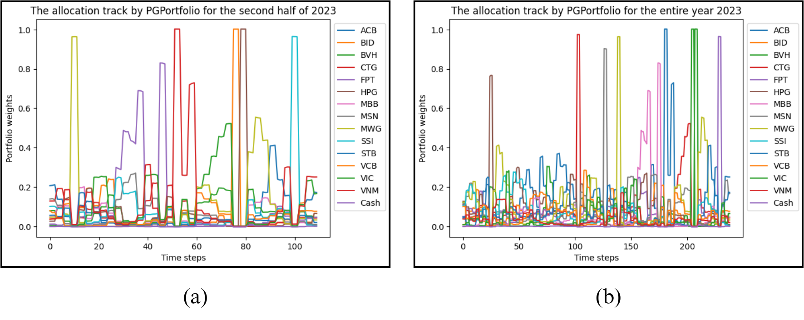

# Exploring the potential of Policy Gradient Portfolio: A Deep RL framework for Portfolio Management in Vietnamese stock market

This project is the source code of the paper <i>[Exploring the potential of Policy Gradient Portfolio: A Deep RL framework for Portfolio Management in Vietnamese stock market](https://github.com/VoHieu2402/PGPortfolio_VNStocks/blob/master/%5BFTUWPS_2_2023-24%5D_VoMinhHieu.pdf)</i>

We draws inspiration from the deep reinforcement learning framework for portfolio management proposed by [Jiang et al. in 2017](https://arxiv.org/abs/1706.10059). I conduct further investigation into the original architecture introduced by Jiang et al, tailoring it for implementation in the Vietnamese stock market. The portfolio encompasses 14 distinct stocks, detailed in below table. The objective is to formulate a reward function that maximizes the risk-adjusted return of the portfolio relative to the benchmark (VNI - VN Index)

| Num | Ticker | Description
| --- | --- | --- |
| 1 | ACB | Asia Commercial Joint Stock Bank
| 2 | BID | Joint Stock Commercial Bank for Investment and Development of Vietnam (BIDV)
| 3 | BVH | BaoViet Holding
| 4 | CTG | Vietnam Joint Stock Commercial Bank for Industry and Trade (VietinBank)
| 5 | FPT | FPT Corporation
| 6 | HPG | Hoa Phat Group
| 7 | MBB | Military Commercial Joint Stock Bank
| 8 | MSN | Masan Group
| 9 | MWG | Mobile World Investment Corporation (The Gioi Di Dong)
| 10 | SSI | SSI Securities Corporation
| 11 | STB | Sai Gon Thuong Tin Joint Stock Commercial Bank (Sacombank)
| 12 | VCB | Joint Stock Commercial Bank for Foreign Trade of Vietnam (Vietcombank)
| 13 | VIC | Vingroup Joint Stock Company
| 14 | VNM | Vinamilk


## Usage Guideline

To begin, ensure the installation of the necessary packages outlined in the <i>requirements.txt</i> file. The focal point of my repository revolves around the training and testing processes. The training process is executed through the <i>train.py</i> file. If required, you have the flexibility to modify hyperparameters for the agent and training process; however, it is imperative to have a clear understanding of each parameter. No validation function is implemented to assess the suitability of hyperparameters, so errors may arise if the provided parameters are inappropriate. Subsequent to the training phase, the trained agent is saved as a pickle file. The <i>test.py</i> file is designed to load this pickle file for testing purposes, accompanied by visualizations of the performance. Finally, the performance of the virtual agent is evaluated against relative benchmarks in the file <i>relative_performance_eval.py</i>

### Quick Start
Start with following commands:
```
$ git clone https://github.com/VoHieu2402/PGPortfolio_VNStocks
$ cd PGPortfolio_VNStocks
$ python train.py
$ python test.py
$ python utils/relative_performance_eval.py
```

### File Structure

- <b>data/torch_tensor_vn_stocks</b>: In this research, we get historical price data from the Investing’s database. The dataset, from 24/02/2015 to 19/12/2023, consists of 2174 observations of daily OHLC data. To facilitate our analysis, we divide the dataset into distinct training and testing sets. The training set includes 1933 observations, from 24/02/2015 to 18/11/2022. The testing set includes 241 observations, ranging from 03/01/2023 to 19/12/2023. There is a gap between the training set and the testing one. This is because the first testing step starts on 03/01/2023 and it requires 30 lag values to input to the neural policy network. To check the robustness of the virtual trader, we do a back-test experiment twice. The first attempt is to cover the whole 241 time steps of the testing dataset, equivalent to the entire year. The second experiment is only carried out to cover a second half of the year 2023. While the entire year 2023 witnessed a growth of VNINDEX by more than 5%, the latter half experienced a sharp decline. This choice of back-test experiments is motivated by the observation of distinct market trends during 2023, and we aim to evaluate the framework's performance under different conditions.
    - <b>state_tensor_pf_vnstocks_train.pt</b>: A PyTorch tensor that holds information about the state of 14 different stocks for training. It undergoes processing as described in the original paper. It has shape: <i>(batch_size, num_features, num_stocks, num_lags)</i>
    - <b>state_tensor_pf_vnstocks_test_halfyear.pt</b>: A PyTorch tensor that holds information about the state of 14 different stocks for the halfyear testing experiment. It undergoes processing as described in the original paper. It has shape: <i>(batch_size, num_features, num_stocks, num_lags)</i>
    - <b>state_tensor_pf_vnstocks_test_fullyear.pt</b>: A PyTorch tensor that holds information about the state of 14 different stocks for the fullyear testing experiment. It undergoes processing as described in the original paper. It has shape: <i>(batch_size, num_features, num_stocks, num_lags)</i>
    - <b>state_tensor_pf_VNI_train.pt</b>: A PyTorch tensor that holds information about the state of the benchmark (VN Index) for training. It undergoes processing as described in the original paper. It has shape: <i>(batch_size, num_features, 1, num_lags)</i>
    - <b>state_tensor_pf_VNI_test_halfyear.pt</b>: A PyTorch tensor that holds information about the state of the benchmark (VN Index) for the halfyear testing experiment. It undergoes processing as described in the original paper. It has shape: <i>(batch_size, num_features, 1, num_lags)</i>
    - <b>state_tensor_pf_VNI_test_halfyear.pt</b>: A PyTorch tensor that holds information about the state of the benchmark (VN Index) for the fullyear testing experiment. It undergoes processing as described in the original paper. It has shape: <i>(batch_size, num_features, 1, num_lags)</i>
- <b>data/benchmark_performance</b>: It contains csv files representing the performance of relative benchmarks for both halfyear and fullyear experiments.
- <b>deep_learning_model</b>:
    - <b>actor_network.py</b>: The deep neural network that determines the allocation directly based on the state tensor. The architecture of the network is described in the original paper.
- <b>reinforcement_learning_algorithms</b>:
    - <b>replay_buffer.py</b>: The database used to stores experiences in the form of tuples <i>(state_portfolio, action, reward, next_state_portfolio, state_benchmark, next_state_benchmark, prev_action, prev_pf, prev_bm, pre_each_asset)</i>, representing the agent's interactions with the environment at different time steps.
    - <b>policy.py</b>: The policy that select actions using actor network.
    - <b>agent.py</b>: An agent that interacts with an environment with the goal of learning optimal actions to maximize cumulative rewards over time. It is responsible for making decisions, taking actions, and learning from the consequences of those actions.
- <b>train.py</b>: During the training process, the agent undergoes many episodes, each involving the management of a portfolio comprising 14 distinct stocks and cash to maximize the final risk-adjusted return. In each episode, the agent has traded over the whole period of the training dataset.
- <b>test.py</b>: The tested agent evaluates the portfolio management strategy over a period comprising 112 time steps. Additionally, visualizations are generated in this file.
- <b>utils/utility</b>: A function which calculates financial evaluation metrics.
- <b>utils/relative_performance_eval.py</b>: Calculate the financial evaluation metrics of agents against those of relative benchmarks.


## New contributions to the original architecture

### Reward function

While the original framework calculates the reward as the explicit average of periodic logarithmic returns, my project defines the reward function that employs the difference between the agent's risk-adjusted return and that of the benchmark (Sharpe ratio). This addition of a risk element aims to enhance the stability of the portfolio management strategy, preventing excessive allocation to specific assets.

Moreover, employing risk-adjusted returns allows us to track the value of the portfolio over time. Integrating the portfolio value into the model enhances the agent's awareness of its position, facilitating more informed decision-making.

### Learning rate schedules

Instead of utilizing a constant learning rate, I utilize learning rate schedules to reduce the learning rate after each episode. This method is believed to improve the optimization process, particularly in the context of risk-adjusted returns, where daily returns are often very small.

## Performance and some discussion

### Performance
The experimental outcomes revealed that PGPortfolio not only surpassed the market but also outperformed comparable benchmarks. Throughout the entirety of 2023, where the market index witnessed a modest 5% growth and other ETF fund indices achieved growth ranging from 5% to 20%, PGPortfolio achieved a remarkable return rate of 31% when ignoring transaction costs. Accounting for transaction costs did impact its performance, yet it continued to demonstrate effectiveness compared to alternative benchmarks. Notably, PGPortfolio achieved these impressive returns with significantly lower associated risks compared to the market and benchmarks. During the bearish trend in the latter half of 2023, PGPortfolio stood as the only portfolio exhibiting positive growth, while others observed declines in their portfolio values. This suggests a superior risk consideration, as evidenced by its smaller maximum drawdown. Furthermore, its Sharpe ratio, Sortino ratio, and Information ratio provide additional evidence of the effective trading strategies employed by PGPortfolio.

<b>Table 1 - The results of the experiment for the second half of the year 2023</b>
|  | Name | ShR | SoR | MDD | InR | CumVal
| --- | --- | --- | --- | --- | --- | ---
| 1 | VNINDEX | -0.0378 | -0.0548 | -0.1745 | | 0.9407
| 2 | FUESSV50 | -0.0115 | -0.0179 | -0.2142 | 0.0114 | 0.9534
| 3 | FUESSV30 | -0.0347 | -0.0506 | -0.1612 | 0.0006 | 0.9401
| 4 | FUEMAV30 | -0.0293 | -0.0423 | -0.1739 | 0.0221 | 0.9496
| 5 | FUEVFVND | 0.0035 | 0.0056 | -0.1674 | <b>0.0570**</b> | 0.9936
| 6 | FUEVN100 | -0.0071 | -0.0104 | -0.1583 | <b>0.0564*</b> | 0.9833
| 7 | PGPortfolio - 0.00% | <b>0.0476***</b> | <b>0.0937***</b> | <b>-0.0981***</b> | <b>0.0607***</b> | <b>1.0766***</b>
| 8 | PGPortfolio - 0.10% | <b>0.0287**</b> | <b>0.0560**</b> | <b>-0.1065**</b> | 0.0455 | <b>1.0390**</b>
| 9 | PGPortfolio - 0.15% | <b>0.0192*</b> | <b>0.0372*</b> | <b>-0.1108*</b> | 0.0379 | <b>1.0207*</b>
| 10 | PGPortfolio - 0.20% | 0.0096 | 0.0187 | -0.1150 | 0.0303 | 1.0026
| 11 | PGPortfolio - 0.25% | 0.0001 | 0.0002 | -0.1191 | 0.0226 | 0.9850

<b>Table 2 - The results of the experiment for the full year 2023</b>
|  | Name | ShR | SoR | MDD | InR | CumVal
| --- | --- | --- | --- | --- | --- | ---
| 1 | VNINDEX | 0.0246 | 0.0363 | -0.1745 | | 1.0502
| 2 | FUESSV50 | 0.0457 | 0.0785 | -0.2142 | <b>0.0335*</b> | <b>1.2048*</b>
| 3 | FUESSV30 | 0.0245 | 0.0362 | -0.1612 | 0.0082 | 1.0621
| 4 | FUEMAV30 | 0.0243 | 0.0369 | -0.1739 | 0.0050 | 1.0527
| 5 | FUEVFVND | 0.0340 | 0.0541 | -0.1674 | 0.0195 | 1.0863
| 6 | FUEVN100 | 0.0408 | 0.0628 | -0.1583 | 0.0272 | 1.1016
| 7 | PGPortfolio - 0.00% | <b>0.0860***</b> | <b>0.1620***</b> | <b>-0.0981***</b> | <b>0.0544*** </b> | <b>1.3168***</b>
| 8 | PGPortfolio - 0.10% | <b>0.0685**</b> | <b>0.1275**</b> | <b>-0.1065**</b> | <b>0.0402**</b> | <b>1.2375**</b>
| 9 | PGPortfolio - 0.15% | <b>0.0596*</b> | <b>0.1105*</b> | <b>-0.1108*</b>| 0.0331 | 1.1996
| 10 | PGPortfolio - 0.20% | 0.0507 | 0.0935 | -0.1150 | 0.0260 | 1.1628
| 11 | PGPortfolio - 0.25% | 0.0417 | 0.0766 | -0.1191 | 0.0188 | 1.1271

Note: ( *** ): 1st highest; ( ** ): 2nd highest; ( * ): 3nd highest

<!-- 


 -->



### Limitations and proposed improvements

- <b>Concentrated Stock Allocation:</b> The agent frequently assigns a significant portion of funds to specific stocks during various timeframes. In practical scenarios, it is crucial to control the allocation of each stock within a safe range to prevent the portfolio from being exposed to excessive risks. To address this issue, users can introduce a regularization term to the loss function, penalizing large weights assigned to specific stocks.

- <b>Simplistic Market State Representation:</b> This project utilizes historical Close-High-Low (CHL) data for each stock to represent the market state, without considering relationships between stocks. Real markets are more intricate, necessitating the inclusion of additional features such as news, social sentiment, timing, economic and financial health of companies, etc. Moreover, an ideal representation should capture spatial and temporal relationships between stocks, where Graph Neural Networks (GNN) can be a suitable choice for market embedding.

- <b>Outdated Deep Learning Models:</b> The project architecture draws inspiration from Jiang et al. in 2017, employing a 1D CNN. Given the evolving landscape since 2017, exploring state-of-the-art deep learning approaches such as LSTM or Transformer is recommended for enhanced capabilities in capturing temporal dynamics.

## Disclaimer

This project is intended for educational purposes only. It does not provide financial advice, and there is no warranty for any potential losses incurred through real-world applications. Users are urged to exercise caution and seek professional advice for their specific financial decisions.

## Author

* **Vo Minh Hieu** [Hieu Vo](https://www.linkedin.com/in/hieu-vo-897a12158/)


