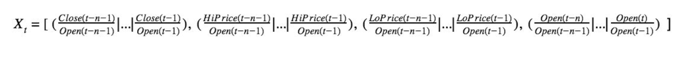
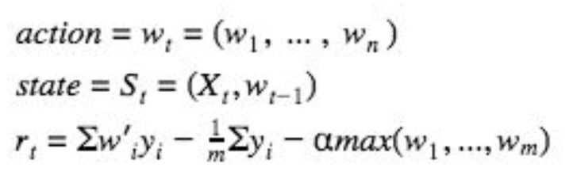
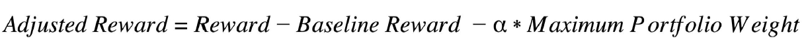
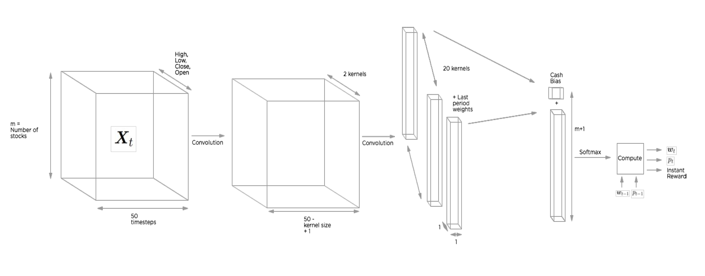
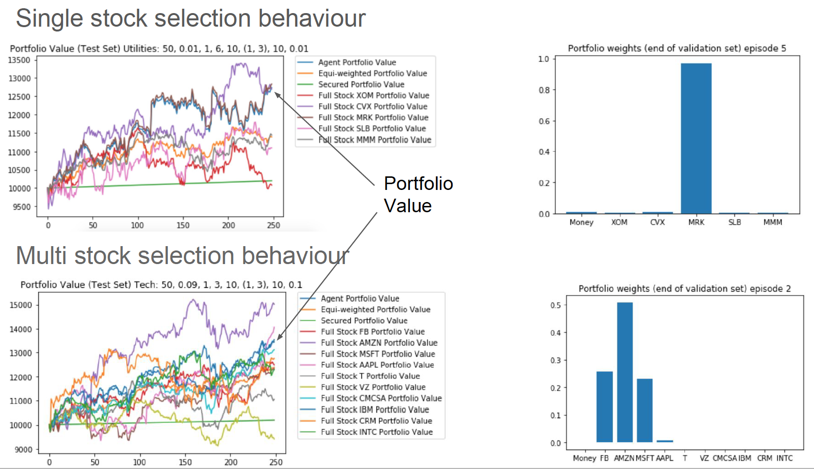
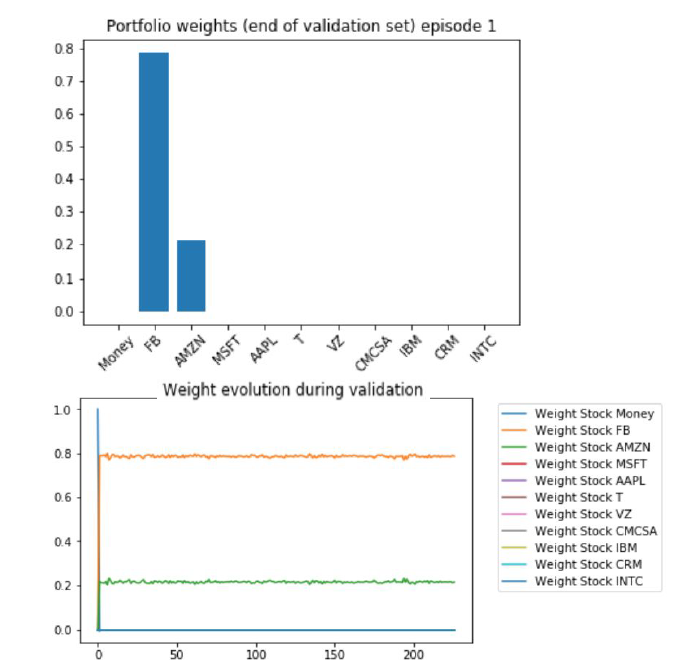

# A DRL Framework for Portfolio Management: Application for Vietnamese stocks

This project draws inspiration from the deep reinforcement learning framework for portfolio management proposed by [Jiang et al. in 2017](https://arxiv.org/abs/1706.10059). I conduct further investigation into the original architecture introduced by Jiang et al, tailoring it for implementation in the Vietnamese stock market. The portfolio encompasses 14 distinct stocks, detailed in below table. The objective is to formulate a reward function that maximizes the risk-adjusted return of the portfolio relative to the benchmark (VNI - VN Index)

| Num | Ticker | Description
| --- | --- | --- |
| 1 | ACB | Asia Commercial Joint Stock Bank
| 2 | BID | Joint Stock Commercial Bank for Investment and Development of Vietnam (BIDV)
| 3 | BVH | BaoViet Holding
| 4 | CTG | Vietnam Joint Stock Commercial Bank for Industry and Trade (VietinBank)
| 5 | FPT | FPT Corporation
| 6 | HPG | Hoa Phat Group
| 7 | MBB | Military Commercial Joint Stock Bank
| 8 | MSN | Masan Group
| 9 | MWG | Mobile World Investment Corporation (The Gioi Di Dong)
| 10 | SSI | SSI Securities Corporation
| 11 | STB | Sai Gon Thuong Tin Joint Stock Commercial Bank (Sacombank)
| 12 | VCB | Joint Stock Commercial Bank for Foreign Trade of Vietnam (Vietcombank)
| 13 | VIC | Vingroup Joint Stock Company
| 14 | VNM | Vinamilk

## Usage Guidline

To begin, ensure the installation of the necessary packages outlined in the <i>requirements.txt</i> file. The focal point of my repository revolves around the training and testing processes. The training process is executed through the <i>train.py</i> file. If required, you have the flexibility to modify hyperparameters for the agent and training process; however, it is imperative to have a clear understanding of each parameter. No validation function is implemented to assess the suitability of hyperparameters, so errors may arise if the provided parameters are inappropriate. Subsequent to the training phase, the trained agent is saved as a pickle file. The <i>test.py</i> file is designed to load this pickle file for testing purposes, accompanied by visualizations of the performance.

### File Structure

<table>
    <thead>
        <tr>
            <th>Layer 1</th>
            <th>Layer 2</th>
            <th>Layer 3</th>
        </tr>
    </thead>
    <tbody>
        <tr>
            <td rowspan=4>L1 Name</td>
            <td rowspan=2>L2 Name A</td>
            <td>L3 Name A</td>
        </tr>
        <tr>
            <td>L3 Name B</td>
        </tr>
        <tr>
            <td rowspan=2>L2 Name B</td>
            <td>L3 Name C</td>
        </tr>
        <tr>
            <td>L3 Name D</td>
        </tr>
    </tbody>
</table>

| Folder | File | Exported to | Description
| --- | --- | --- | --- |
| data | ACB | Asia Commercial Joint Stock Bank
| 2 | BID | Joint Stock Commercial Bank for Investment and Development of Vietnam (BIDV) ||
| 3 | BVH | BaoViet Holding
| 4 | CTG | Vietnam Joint Stock Commercial Bank for Industry and Trade (VietinBank)
| 5 | FPT | FPT Corporation
| 6 | HPG | Hoa Phat Group
| 7 | MBB | Military Commercial Joint Stock Bank
| 8 | MSN | Masan Group
| 9 | MWG | Mobile World Investment Corporation (The Gioi Di Dong)
| 10 | SSI | SSI Securities Corporation
| 11 | STB | Sai Gon Thuong Tin Joint Stock Commercial Bank (Sacombank)
| 12 | VCB | Joint Stock Commercial Bank for Foreign Trade of Vietnam (Vietcombank)
| 13 | VIC | Vingroup Joint Stock Company
| 14 | VNM | Vinamilk

## Deep Policy Network Design 

### RL Framework

The portfolio manager agent is set-up in the way:
- The <b>state</b> (at time t) is the input matrix and the previous portfolio weights (at time t-1). 
- The <b>action</b> is the vector of investment weight (at time t).
- The <b>reward function</b> is defined such as it is the agent's return minus a baseline’s return (baseline is an equi weighted agent - invest in all the possible stocks in the same way) minus a term proportional to the maximum of the weight (this term is set-up to make the agent avoids to invest fully in one stock)

### Deep Policy Function Architecture

The policy function is designed through a deep neural network which takes as input the input tensor (shape m x 50 x (3 or 4)) composed of :
- the m traded stocks 
- the 3/4 matrix columns (processed OHLC)
- 5O previous time steps

A first convolution is realized resulting in a smaller tensor. Then, a second convolution is made resulting in 20 vector of shape (m x 1 x 1). The previous output vector is stacked. 
The last layer is a terminate convolution resulting in a unique m vector. 
Then, a cash bias is added and a softmax applied. 

The output of the neural network is the vector of the actions the agent will take. 

Then, the environment can compute the new vector of weights, the new portfolio and instant reward.

## Training and Testing of the agent

This part is still in progress as of today. Our thought is we are still not able to reproduce the paper's results. 
Indeed, even if the algorithm demonstrated the capacity to identify high-potential stocks which maximizes results. However, it has a little potential to change the position through the trading process. 

## Understanding the problem & possible improvement

We tried many initial parameters such as low trading cost to produce incentive to change of position. 

The agent is 'training sensitive' but it is not 'input state sensitive'. 

In order to make the policy more dynamic, we think of using a discrete action space using pre-defined return thresholds. We'll turn the problem replacing the softmax by a tanh or by turning it into a classification task. 

## Author

* **Selim Amrouni** [selimamrouni](https://github.com/selimamrouni)
* **Aymeric Moulin** [AymericCAMoulin](https://github.com/AymericCAMoulin)
* **Philippe Mizrahi** [pcamizrahi](https://github.com/pcamizrahi)

